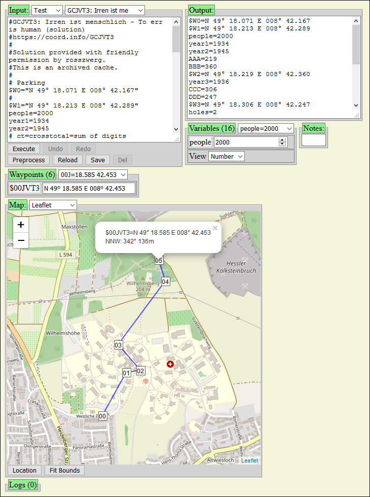

# GCFiddle - Fiddle with Geocaching Waypoints

GCFiddle is a tool to compute waypoints for [Geocaching](https://www.geocaching.com/) and show them on a map.
It has a build-in interpreter for a simple calculation language similar to the "Wolf Language"
used by [CacheWolf](https://github.com/cachewolf/cachewolf) ([CacheWolf Homepage](http://cachewolf.aldos.de/)).
It can also extract waypoints and variables from geocache descriptions.

GCFiddle Links:
[Source code](https://github.com/mavi13/GCFiddle/),
[HTML Readme](https://github.com/mavi13/GCFiddle/#readme),
[GCNEW1](https://mavi13.github.io/GCFiddle/gcfiddle.html),
[GCJVT3](https://mavi13.github.io/GCFiddle/gcfiddle.html?example=GCJVT3),
[GC45QJ1](https://mavi13.github.io/GCFiddle/gcfiddle.html?example=GC45QJ1)

[](https://travis-ci.com/mavi13/GCFiddle)

## Features

- Calculation language similar to "Wolf Language" used by CacheWolf's solver
- Modify variables temporarily and see its effect on the calculation
- Show waypoints on a simple map, Open Street Map or with Google Maps (needs [Google API key](https://developers.google.com/maps/documentation/geocoding/get-api-key))
- Extract waypoints and variables from geocache descriptions (preprocessing)
- Load geocache example scripts stored in files or in local storage of the browser
- Runs locally without a server, also on mobile devices
- HTML5 / JavaScript without external libraries

## Usage

- Simply open gcfiddle.html in a browser.
  The user interface shows several boxes which can be shrunk and expanded by pressing the green buttons.
  There are boxes for Script, Result, Variables, Waypoints, Map and some special boxes
  for GCFiddle andvanced, Filter, Sort, Logs and Notes.



### GCFiddle box

- The first selection field selects the database. The default is the read only "test DB" defined in file system or on the server and "Saved" in Browser local storage.
- The "Reload" button reloads the page with the current settings. (Please note that changes to the script are lost!)
   See the list of URL parameters below.
- The "Help" button opens the Readme on the server.
- There are additional buttons with some advanced functionality, which will be shown when you click on "GCFiddle" (not shown here, you can skip it for first reading):
  - The "Index" button create an example index and shows it as result. This can be copied into an example index file.
  - The "Remove Logs" button removes the log entries from the scripts metadata "#GC_INFO", if available.
    This could be useful, if you want to shrink the script metadata comment.
  - The "Console" button activates the console for debugging

### Filter box

- Allows to filter the script examples by category, id or title. For example, 7 out of 7 are shown.

### Sort box

- Allows to sort the script examples by id, title or distance. The distance is computed from a location waypoint which can be filled by the location button below.

### Script box

- The selection field loads a geocache calculation script and executes it
- The input field contains the editable script
- The "Preprocess" button processes the input text (not a script but a textual geocache description copied from geocaching.com) and tries to convert it to a script. This means it comments lines and tries to find variables (e.g. a=...) and waypoints (e.g. N...°...E...°). If the input starts with "<?xml", is is assumed to be a gpx file and parsed as XML (currently to extract waypoints).
  The resulting script is put in the history and executed.
- The "Execute" button executes the input script and fills the other boxes with the output.
   It also puts changed input in a history which can be accessed by the "Undo" and "Redo" buttons.
- The "Save" button saves the current input in "Saved" database and selects it.
   It is stored in browser local storage which means that it is kept also during page reloads.
- The "Delete" button deletes the current geocache in "Saved" database. There is a confirmation dialog to prevent accidential delete.

### Result box

- Shows the result of the script execution
- If you mark a variable or a waypoint, it will be selected in the variable box or in the waypoint box, respectively. If you do so, the map is centered to the selected waypoint.

### Variable box

- Allows you to select a variable that is found during script execution and fiddle with it.
   That means you can change it temporarily without changing the script.
   Changed variables are marked with "[c]".
- Also, the general view type of the variable can be changed. If view type "number" is selected but a variable is not a number, it is still displayed as text.
   The range slider currently uses the interval 0 to 9999.

### Waypoint box

- Allows you to select a waypoint found during script execution and fiddle with it. That means you can change it temporarily without changing the script.
   Changed waypoints are marked with "[c]".
- Waypoints are variables that begin with a dollar sign "$": e.g. `$W1`.

- The waypoint format can be changed. This affects the hover popup for the waypoint input field and the marker popups on the map. Usually waypoints are shown in the same format as they were defined. Possible formats:
  - "" (Automatic, as input)
  - dmm (deg-min.min), e.g. `N 49° 16.130 E 008° 40.453`
  - dms (deg-min-sec), e.g. `N 49° 16' 07.80" E 008° 40' 27.18"`
  - dd (decimal degrees), e.g. `N 49.26883° E 008.67422°`
  - dmmc (deg-min.min with comment), e.g. `N 49° 16.130 E 008° 40.453!category!title`
  - dmsc (deg-min-sec with comment)
  - ddc (decimal degrees with comment)

### Map box

- To show waypoints on a map.
- The selection field selects a Leaflet or OpenLayers Open Street Map (online), Google Maps (online), a simple map (offline, for testing only), or no map.
- For Google Maps you need to get a Google API key and set it in gcfiddle.js, in gcconfig.js or as a URL parameter.
- Clicking on a waypoint opens a popup (info box) with coordinates and distance and direction information from the preceding waypoint.
   When you move the waypoint around, the popup is moved as well and its coordinates are updated. Clicking on "x" closes the popup.
- Zooming and moving the map are also possible.

### Log box

- To show log entries. These are created during preprocessing and put in the scripts metadata.

### Note box

- Allows you to write some notes. (Currently notes are not stored.)

### Console box

- Advanced, usually not visible. Can be activated for debugging.

## Calculation language

- Line comments start with a hash "#": `# comment until end of line`
- Numbers are composed of digits 0..9 and a decimal point: `34` or `3.14`
- Strings are surrounded by quotations: `"3.14"`
  - Character escaping with backslash in quoted strings: `"a\"b\"\nc"` => `a"b"<newline>c`
  - Strings can also be surrounded by apostrophes  (no escaping): `'3.14'`, can contain quotations: `'quotations: "'`
  - Strings in brackets are concatenated: `["5" "3." "14"]` = `"53.14"`
  - Type conversion: Numbers in brackets are converted to strings: `[ 5 "3." 14 ]` = `"53.14"`
  - Number formatting with suffix pattern: `3.14159:000.00:` => `"003.14"`
- Operators +, -, *, / % ^ are used for for numerical addition, subtraction, multiplication, division, modulo and exponential operation.
 (Note: Operator "%" is not supported by WolfLanguage, use mod() function, see below.)
  - Parenthesis "(", ")" can be used for grouping as usual
  - Type conversion: Strings are converted to numbers: `"5"+3.14` => `8.14`, `"5"+"3.14"` = `8.14`
- Variable names start with a character and may contain digits: `a1=3.14`, use: `a1` = `3.14`
- Waypoints are string variables with a special format starting with dollar sign: `$W1="N 49° 16.130 E 008° 40.453"`
- Functions can be defined `f()=3.14` or called: `f()` => `3.14`
  - Functions with parameter: `f(x)=3.14*x`, called: `f(2)` => `6.28`
  - Functions with multiple parameters: `f(x,y)=x*y`, called: `f(2,3)` => `6`

### List of predefined functions

- If not mentioned otherwise, type conversion is done as needed.
- Functions which are not available in CacheWolf are marked with [+].

#### Helper functions

- getconst(s): get constant "PI" or "E": `getconst("PI")` = `3.141592653589793`, `getconst("E")` = `2.718281828459045` [+]
- d2r(d): convert degrees to radians (d * Math.PI / 180)
- r2d(r): convert radians to degrees (r * 180 / Math.PI)

#### Trigonometric functions

- sin(d): sine of a number d given in degrees: `sin(90)` = `1`
- cos(d): cosine of a number d given in degrees: `cos(0)` = `1`
- tan(d): tangent of a number d given in degrees: `tan(45)=sin(45)/cos(45)`
- asin(x): arcsine (in degrees) of a number x
- acos(x): arccosine (in degrees) of a number x
- atan(x): arctangent (in degrees) of a number x: `atan(1)` = `45`

#### Numerical functions

- abs(x): absolute value of number x: `abs(-3.14)` = `3.14`
- round(x): round x to nearest integer: `round(3.14)` = `3`, `round(3.54)` = `4`, , `round(-3.54)` = `-4` [+]
- ceil(x): ceiling function: round x to nearest integer >= x: `ceil(3.54)` = `4`, `ceil(-3.54)` = `-3` [+]
- floor(x): floor function:  round x to nearest integer <= x: `floor(3.54)` = `3`, `floor(-3.54)` = `-4` [+]
- int(x): integer value of x (floor() for x > 0, otherwise ceil()): `int(3.54)` = `3`, `int(-3.54)` = `-3`
- mod(x, y): modulo operation x % y, reminder of x / y: `mod(25, 7)` = `4`, `mod(-13, 64)` = `-13`
- log(x): natural logarithm (base E) of a number x: `log(8)/log(2)` = `3` [+]
- exp(x): exponential function e ^ x: `exp(0)` = `1` [+]
- sqrt(x): square root of a number x: `sqrt(9)` = `3`
- min(x, y): minimum of numbers x and y: `min(3.14, 4)` = `3.14` [+]
- max(x, y): maximum of numbers x and y: `max(3.14, 4)` = `4` [+]
- random(): pseudo-random number (0 <= x < 1): `random()` [+]
- gcd(x, y): greatest common divisor of x and y: `gcd(1071, 1029)` = `21` [+]
- fib(n): the nth Fibonacci number, the sum of the two preceding ones: `fib(50)` = `12586269025` [+]
- ct(n): crosstotal of the number n (sum of digits): `ct(1234567890)` = `45`
  - Works also for strings: `ct("1234567890")` = `45`
  - Other characters are ignored: `ct("R9z876gh5432%.*^/+-10")` = `45`
  - Crosstotal of crosstotal: `ct(ct(1234567890))` = `9`
- cti(n): crosstotal iterative of the number n (sum of digits until < 10): `cti("1234567890")` = `9` [+]
  - Other characters are ignored: `cti("R9z876gh5432%.*^/+-10")` = `9`
- (zformat(n, len): zero padding to len characters: `zformat(0, 3)` = `"000"`,  `zformat(8.2, 5)` = `"008.2"`) [+]

#### String functions

- val(s): sum of the character values: `val("a")` = `1`, `val("Z")` = `26`
  - special characters and numbers are ignored: `val("äöüß")` = `0`, `val(1234567)` = `0`
- sval(s): list of the character values: `sval("ABCDEFGZz")` = `"01 02 03 04 05 06 07 26 26"`
  - Special characters are ignored: `sval("ABCxyzäöü")` = `"01 02 03 24 25 26"`
- vstr(s, i): inverse of sval() with an optional parameter to shift characters by i places. [+]
- encode(s, m1, m2): encode s with character mapping m1 to m2:
  - `encode("ABBA17abba", "AB7", "OS2")` = `"OSSO12abba"`
- instr(s, s2): first index of s2 in s, starting at 1; 0=not found: `instr("abca", "a")` = `1`, `instr("abca", "d")` = `0`
- instr(s, s2, i): same as instr(s, s2) but with optional start parameter i > 0
   (CacheWolf also supports this variant but expects i as first parameter!)
- len(s): length of string s: `len("abc")` = `3`, `len("")` = `0`
- countstr(s, s2): Count number of occurrences of substring s2 in s: `count("abba", "a")` = `2`. [+]
- count(s, c): count individual characters from s2 in string s: `count("abba", "a")` = `2`. For multiple characters, list the counts separately: `count("abba", "ab")` = `"a=2 b=2"`.
- mid(s, index, len): substring starting at index (>=1) and length: `mid("abcABCabc", 3, 5)` = `"cABCa"`
- uc(s): uppercase string (caution: Chrome converts "ß" to "SS"!): `uc("abcäöüABC")` = `"ABCÄÖÜABC"`
- lc(s): lowercase string: `lc("ABCÄÖÜßabc")` = `"abcäöüßabc"`
- replace(s, s1, r1): replace all occurrences of s1 in s by r1: `replace("abcABCabc", "bc", "Xy")` = `"aXyABCaXy"`
- reverse(s): reverse string s: `reverse("abcZ")` = `"Zcba"`
- rot13(s): rotate the alphabet by 13 positions: `rot13("abcdefghijklmnopqrstuvexyzABC")` = `"nopqrstuvwxyzabcdefghirklmNOP"`

#### Waypoint computations

Coordinate formats:

- `dmm` (degrees, minutes, minutes), e.g. `"N 49° 16.130 E 008° 40.453"` (default)
- `dms` (degrees, minutes, seconds), e.g. `"N 49° 16' 07.80\" E 008° 40' 27.18\""`
- `dd` (decimal degrees), e.g. `"N 49.26883° E 008.67422°"`

We assume here:

``` perl
$W1="N 49° 16.130 E 008° 40.453"
$W2="N 49° 15.903 E 008° 40.777"
```

- bearing($W1, $W2): bearing between $W1 and $W2 in degrees:
  - `round(bearing($W0, $W1))` = `137`
- cb($W1, b1, $W1, b2): crossbearing
  - `cb($W1, 78, $W2, 7)` = `"N 49° 16.182 E 008° 40.830"`
- distance($W1, $W2): distance in meters:
  - `distance($W1, $W2)` = `575`
- project($W1, angle, distance): project from $W1 angle degrees and distance meters
  - `project($W1, 137, 575)` = `$W1`
- midpoint($W1, $W2): midpoint between $W1 and $W2 [+]
  - `midpoint($W1, $W2)` = `project($W1, bearing($W1,$W2), distance($W1,$W2)/2)`
- format($W1, fmt): format waypoint $W1 (dmm, dms, dd):
  - `format($W1, "dmm")` = `$W1` = `"N 49° 16.130 E 008° 40.453"`
  - `format($W1, "dms")` = `"N 49° 16' 07.80\" E 008° 40' 27.18\""`
  - `format($W1, "dd")` = `"N 49.26883° E 008.67422°"`

#### Other functions

- ic(x): ignore case for variables, 0=false (default), 1 (or number <>0)=true; without x returns status "true" or "false".
  The default can also be changed with the setting `ignoreVarCase`.
- isequal(x, y): ... [+]
- assert(s1, s2): asserts that s1 is equal to s2 [+]
- parse(s): Parses script in s; returns output and possible error messages [+]
- cls(): clear output
- concat(s1, s2, ...): internal function to concatenate strings (use brackets to concatenate strings) [+]

### Differences in the calculation language of GCFiddle and WolfLanguage from CacheWolf

- Most of the functions are also available in CacheWolf, so it is possible to write calculation scripts for both interpreters. (Functions which are not available in CacheWolf are marked with [+].)
- Please see the examples on the test page [GCTEST1](https://mavi13.github.io/GCFiddle/gcfiddle.html?example=GCTEST1).
- Please check the description of the [WolfLanguage](http://cachewolf.aldos.de/index.php/Doku/WolfLanguage) (only in German).

#### Some differences when using GCFiddle

- Strings can also be surrounded by apostrophes `'` (no character escaping).
- To concatenate strings, they must be placed in brackets `[`...`]`. Separation by spaces is not enough
- Per default, functions and variables are case-sensitive. This can be changed with a setting or with `ic(0)` for variables. (In WolfLanguage, ignore case is the default.)
- Possibility to define new functions, e.g. `f(x,y)=x+y`
- Number formatting with suffix pattern may contain zero `0` and dot `.` but no hash `#`
- Geodetic calculation of waypoints uses another model with other formulas, so there are slightly different results
- No statement separator, especially no semicolon `;`
- Functions must be used exactly as they are defined, there are no abbreviations or aliases (e.g. `crosstotal` is always `ct`). Also the case is relevent.
- No function: `goto(wp)`, `sk(n)`, `deg()`, `rad()`
- No statements: `IF`, `THEN`, `ENDIF`, `STOP`

## Preprocessing

The preprocessing feature allows to scan the input, extract information and convert it into a script.  Usually the input is a Copy&Paste text from a geocache description on [geocaching.com](https://geocaching.com/). It is also possible to use any text or xml or gpx file content with waypoints.

During preprocessing the following steps are done:

- Convert all text into comments
- Extract variables
  - If there is an equal `=` character, the left part is assumed to be a variable, the right part can be a single value or an expression without spaces\
    `<variable><space(s)>=<space(s)><exprWithoutSpace>`
  - Examples:
    - `some text a=12 more text`\
      =>`#some text a=12 more text`\
      `a=12`
- Extract waypoints
  - Waypoints (especially with formulas) must have some characteristics to be detected:\
  `N<expr>°<expr>.<expr>E<expr>°<expr>.<exprWithoutSpace>`
    - `<expr>` is an expression which may contain spaces, `<exprWithoutSpace>` not.
    - Expressions are not checked for validity.
  - Examples:
    - `N 49° 16.130 E 008° 40.453`
    - `N 49° (A-1)(B).(4*A)(B)(A) E 008° (2*A)(5).(A/2)(3*A)(3*A)`\
      => `$W1=["N 49° " (A-1)(B) "." (4*A)(B)(A) " E 008° " (2*A)(5) "." (A/2)(3*A)(3*A)]`
    - (For more examples, see Preprocessor.qunit.js)
  - If necessary, modify the input before using preprocessing.
- Extract cache information from the sections and put it JSON encoded in a comment line marked with `#GC_INFO:`

## URL parameters as settings

URL parameters override settings in file `gcconfig.js` or `gcfiddle.js`.

- `database=testDB`: Set the database
- `databaseIndex=0dbindex.js`: database index in `exampleDir`
- `debug=0`: Set the debug level, 0=off, 1=some messages, 2=some more,...
- `example=`: Set example script
- `exampleDir=examples`: example base directory
- `filterCategory`: filter by categories (comma separated list, empty means all)
- `filterId`: filter by ID (substring, ignore-case)
- `filterTitle`: filter by title (substring, ignore-case)
- `googleKey`: Set [Google API key](https://developers.google.com/maps/documentation/geocoding/get-api-key)
  - Can also be set in file `gcconfig.js` or `gcfiddle.js`
- `ignoreFuncCase=false`: ignore case for functions
- `ignoreVarCase=false`: ignore case for variables
- `leafletMapboxKey`: mapbox access token (for leaflet maps, currently unused)
- `leafletUrl`: Set URL for the Leaflet library
  - [leaflet, https]("https://unpkg.com/leaflet@1.3.1/dist/leaflet.js") (default)
  - or "lib/leaflet.js" (if available locally)
  - or "lib/leaflet-src.js" (if available locally, debug sources)
- `mapType=leaflet`: Set type of map to `leaflet`, `openlayers`, `google`, `simple` or `none`.
  - For map type `google`, an API key must be set with parameter `googleKey`
- `openLayersUrl`: Set URL for the OpenLayers library
  - [OpenLayers, https]("https://cdnjs.cloudflare.com/ajax/libs/openlayers/2.13.1/OpenLayers.js") (default)  
      or [OpenLayers]("http://www.openlayers.org/api/OpenLayers.js") (http only)  
      or "lib/OpenLayers.js" (if available locally)  
      or "lib/OpenLayers.light.js" (light version with some features missing, e.g. Overview map, keyboard defaults)
- `showConsole=false`: Show console box (for debugging messages)
- `showFilter=false`: Show the filter box
- `showLogs=true`: Show Example Logs
- `showMap=true`: Show the map box
- `showNotes=true`: Show the notes box
- `showResult=true`: Show the result box
- `showScript=true`: Show the script box
- `showSort=false`: Show the sort details
- `showSpecial=false`: Show special functionality
- `showVariable=true`: Show the variable box
- `showWaypoint=true`: Show waypoint box
- `testIndexedDb=false`: test Index Database (experimental)
- `varMin=0`: minimum value for variable
- `varMax=9999`: maximum value for variable
- `varStep=1`: Increment for variable change
- `varType=number`: Set general type of variables in the variable box to `number`, `text` or `range`
  - If a variable is not a number, `text` is used
- `waypointFormat`: Set waypoint output format: `(empty string)`, `dmm`, `dms`, `dd`,  `dmmc`, `dmsc`, `ddc`
- `zoom=15`: Set initial zoom level for Google Maps (usually automatically set)

## Developing, Testing

QUnit test [testsuite.qunit.html](https://mavi13.github.io/GCFiddle/test/testsuite.qunit.html) runs:

- [LatLng.qunit.html](https://mavi13.github.io/GCFiddle/test/LatLng.qunit.html)
- [Preprocessor.qunit.html](https://mavi13.github.io/GCFiddle/test/Preprocessor.qunit.html)
- [ScriptParser.qunit.html](https://mavi13.github.io/GCFiddle/test/ScriptParser.qunit.html)
- ...

## Acknowledgements

- [CacheWolf](https://github.com/cachewolf/cachewolf), I use it for years now...

- Description of [GCJVT3](https://coord.info/GCJVT3) with friendly permission by rosszwerg.
   (Archived cache, solution provided.)

- Description of [GC54QJ1](https://coord.info/GC45QJ1) with friendly permission by kruemelhuepfer.
   (Archived cache, solution provided.)

- Formulas for [GC5TER7](https://coord.info/GC5TER7) with friendly permission by Onetrain.
   (Try to find the solution!)

- Geodesy tools (c) Chris Veness 2002-2016
  - [Latitude/longitude spherical geodesy tools](https://www.movable-type.co.uk/scripts/latlong.html)
  - I picked just the functions that I needed, modified LanLon object to be compatible with Google LatLng object and removed Greek symbols which JSlint does not like.
  - [latlon-spherical on GitHub](https://github.com/chrisveness/geodesy/blob/master/latlon-spherical.js)
  - Thanks for the excellent explanation on geodesy calculations and the library!

- Peter Olson for an article on [How to write a simple interpreter in JavaScript](https://www.codeproject.com/Articles/345888/How-to-write-a-simple-interpreter-in-JavaScript). It was a good starting point for the calculator in GCFiddle.

- [Leaflet](http://leafletjs.com/) and [OpenLayers 2](https://openlayers.org/two/) to display the [Open Street Map](https://www.openstreetmap.org/)

- [Google Maps JavaScript API](https://developers.google.com/maps/documentation/javascript/)

### **mavi13, 05/2019**
