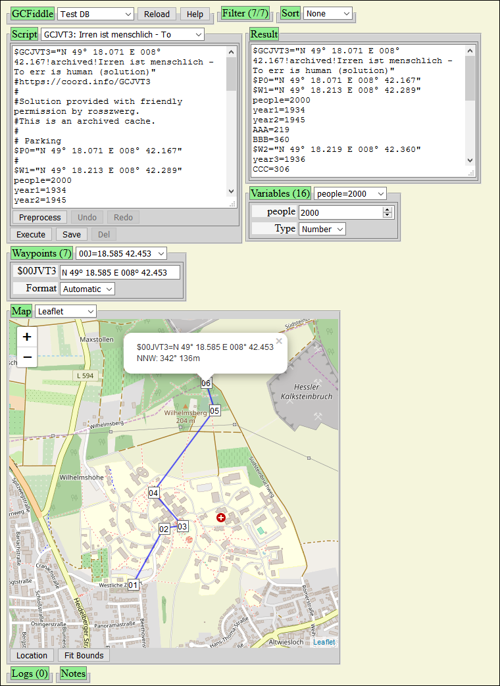

# GCFiddle - Fiddle with Geocaching Waypoints

GCFiddle is a tool to compute waypoints for [Geocaching](https://www.geocaching.com/) and show them on a map.
It has a build-in interpreter for a simple calculation language similar to the "Wolf Language"
used by [CacheWolf](https://github.com/cachewolf/cachewolf) ([CacheWolf Homepage](http://cachewolf.aldos.de/)).
It can also extract waypoints and variables from geocache descriptions.

GCFiddle Links:
[Source code](https://github.com/mavi13/GCFiddle/),
[HTML Readme](https://mavi13.github.io/GCFiddle/),
[GCNEW1](https://mavi13.github.io/GCFiddle/gcfiddle.html),
[GCJVT3](https://mavi13.github.io/GCFiddle/gcfiddle.html?example=GCJVT3)

[](https://travis-ci.com/mavi13/GCFiddle)

## Features

- Calculation language similar to "Wolf Language" used by CacheWolf's solver
- Modify variables temporarily and see its effect on the calculation
- Show waypoints on a simple map, Open Street Map or with Google Maps (needs [Google API key](https://developers.google.com/maps/documentation/geocoding/get-api-key))
- Extract waypoints and variables from geocache descriptions
- Load geocache scripts from an archive
- Runs locally without a server, also on mobile devices
- HTML5 / JavaScript without external libraries

## Usage

- Simply open gcfiddle.html in a browser.
  The user interface shows several boxes which can be shrunk and expanded by pressing the green buttons.
  There are boxes for input, output, variable, note, waypoint and map.



### Input box

- The first selection field selects the database. The default is the read only "testDB" defined in file system or on the server and "Saved" in Browser local storage.
- The second selection field loads a geocache calculation script and executes it
- The input field contains the editable script
- The "Execute" button executes the input script and fills the other boxes with the output.
   It also puts changed input in a history which can be accessed by the "Undo" and "Redo" buttons.
- The "Preprocess" button processes the input text (not a script but a textual geocache description) and
   tries to convert it to a script. This means it comments lines and tries to find variables and waypoints.
   The resulting script is put in the history and executed.
- The "Reload" button reloads the page with the current settings. (Please note that changes to the script are lost!)
   See the list of URL parameters below.
- The "Save" button saves the current input in "Saved" database and selects it.
   It is stored in browser local storage which means that it is kept also during page reloads.
- The "Delete" button deletes the current geocache in "Saved" database. There is a confirmation dialog to prevent accidential delete.

### Output box

- Shows the output of the script execution
- If you mark a variable or a waypoint, it will be selected in the variable box or in the waypoint box, respectively. The map is centered to the selected waypoint.

### Variable box

- Allows you to select a variable that is found during script execution and fiddle with it.
   That means you can change it temporarily without changing the script.
   Changed variables are marked with "[c]".
- Also, the general view type of the variable can be changed. If a variable is not a number, it is displayed as text.
   The range slider currently uses the interval 0 to 9999.

### Note box

- Allows you to write some notes. (Currently notes are not stored.)

### Waypoint box

- Allows you to select a waypoint found during script execution and fiddle with it. That means you can change it temporarily without changing the script.
   Changed waypoints are marked with "[c]".
- Waypoints are variables that begin with a dollar sign "$": e.g. `$W1`.

- The waypoint format can be changed. This affects the hover popup for the waypoint input field and the marker popups on the map. Usually waypoints are output in the same format as they were defined. Possible formats:
  - "" (Automatic, as input)
  - dmm (deg-min.min), e.g. `N 49° 16.130 E 008° 40.453`
  - dms (deg-min-sec), e.g. `N 49° 16' 07.80" E 008° 40' 27.18"`
  - dd (decimal degrees), e.g. `N 49.26883° E 008.67422°`
  - dmmc (deg-min.min with comment), e.g. `N 49° 16.130 E 008° 40.453!comment1`
  - dmsc (deg-min-sec with comment)
  - ddc (decimal degrees with comment)

### Map box

- To show waypoints on a map.
- The selection field selects a Leaflet or OpenLayers Open Street Map (online), Google Maps (online), a simple map (offline, for testing only), or no map.
- For Google Maps you need to get a Google API key and set it in gcfiddle.js, in gcconfig.js or as a URL parameter.
- Clicking on a waypoint opens a popup (info box) with coordinates and distance and direction information from the preceding waypoint.
   When you move the waypoint around, the popup is moved as well and its coordinates are updated. Clicking on "x" closes the popup.
- Zooming and moving the map are also possible.

### Log box

- To show log entries. These are created during preprocessing.

## Calculation language

- Line comments start with a hash "#": `# comment until end of line`
- Numbers are composed of digits 0..9 and a decimal point: `34` or `3.14`
- Strings are surrounded by quotations: `"3.14"`
  - Character escaping with backslash in quoted strings: `"a\"b\"\nc"` => `a"b"<newline>c`
  - Strings can also be surrounded by apostrophes  (no escaping): `'3.14'`, can contain quotations: `'quotations: "'`
  - Strings in brackets are concatenated: `["5" "3." "14"]` = `"53.14"`
  - Type conversion: Numbers in brackets are converted to strings: `[ 5 "3." 14 ]` = `"53.14"`
  - Number formatting with suffix pattern: `3.14159:000.00:` => `"003.14"`
- Operators +, -, *, / % ^ are used for for numerical addition, subtraction, multiplication, division, modulo and exponential operation.
 (Note: Operator "%" is not supported by WolfLanguage, use mod() function, see below.)
  - Parenthesis "(", ")" can be used for grouping as usual
  - Type conversion: Strings are converted to numbers: `"5"+3.14` => `8.14`, `"5"+"3.14"` = `8.14`
- Variable names start with a character and may contain digits: `a1=3.14`, use: `a1` = `3.14`
- Waypoints are string variables with a special format starting with dollar sign: `$W1="N 49° 16.130 E 008° 40.453"`
- Functions can be defined `f()=3.14` or called: `f()` => `3.14`
  - Functions with parameter: `f(x)=3.14*x`, called: `f(2)` => `6.28`
  - Functions with multiple parameters: `f(x,y)=x*y`, called: `f(2,3)` => `6`

### List of predefined functions

- If not mentioned otherwise, type conversion is done as needed.
- Functions which are not available in CacheWolf are marked with [+].

#### Helper functions

- getConst(s): get constant "PI" or "E": `getConst("PI")` = `3.141592653589793`, `getConst("E")` = `2.718281828459045` [+]
- d2r(d): convert degrees to radians (d * Math.PI / 180)
- r2d(r): convert radians to degrees (r * 180 / Math.PI)

#### Trigonometric functions

- sin(d): sine of a number d given in degrees: `sin(90)` = `1`
- cos(d): cosine of a number d given in degrees: `cos(0)` = `1`
- tan(d): tangent of a number d given in degrees: `tan(45)=sin(45)/cos(45)`
- asin(x): arcsine (in degrees) of a number x
- acos(x): arccosine (in degrees) of a number x
- atan(x): arctangent (in degrees) of a number x: `atan(1)` = `45`

#### Numerical functions

- abs(x): absolute value of number x: `abs(-3.14)` = `3.14`
- round(x): round x to nearest integer: `round(3.14)` = `3`, `round(3.54)` = `4`, , `round(-3.54)` = `-4` [+]
- ceil(x): ceiling function: round x to nearest integer >= x: `ceil(3.54)` = `4`, `ceil(-3.54)` = `-3` [+]
- floor(x): floor function:  round x to nearest integer <= x: `floor(3.54)` = `3`, `floor(-3.54)` = `-4` [+]
- int(x): integer value of x (floor() for x > 0, otherwise ceil()): `int(3.54)` = `3`, `int(-3.54)` = `-3`
- mod(x, y): modulo operation x % y, reminder of x / y: `mod(25, 7)` = `4`, `mod(-13, 64)` = `-13`
- log(x): natural logarithm (base E) of a number x: `log(8)/log(2)` = `3` [+]
- exp(x): exponential function e ^ x: `exp(0)` = `1` [+]
- sqrt(x): square root of a number x: `sqrt(9)` = `3`
- min(x, y): minimum of numbers x and y: `min(3.14, 4)` = `3.14` [+]
- max(x, y): maximum of numbers x and y: `max(3.14, 4)` = `4` [+]
- random(): pseudo-random number (0 <= x < 1): `random()` [+]
- gcd(x, y): greatest common divisor of x and y: `gcd(1071, 1029)` = `21` [+]
- fib(n): the nth Fibonacci number, the sum of the two preceding ones: `fib(50)` = `12586269025` [+]
- ct(n): crosstotal of the number n (sum of digits): `ct(1234567890)` = `45`
  - Works also for strings: `ct("1234567890")` = `45`
  - Other characters are ignored: `ct("R9z876gh5432%.*^/+-10")` = `45`
  - Crosstotal of crosstotal: `ct(ct(1234567890))` = `9`
- cti(n): crosstotal iterative of the number n (sum of digits until < 10): `cti("1234567890")` = `9` [+]
  - Other characters are ignored: `cti("R9z876gh5432%.*^/+-10")` = `9`
- (zformat(n, len): zero padding to len characters: `zformat(0, 3)` = `"000"`,  `zformat(8.2, 5)` = `"008.2"`) [+]

#### String functions

- val(s): sum of the character values: `val("a")` = `1`, `val("Z")` = `26`
  - special characters and numbers are ignored: `val("äöüß")` = `0`, `val(1234567)` = `0`
- sval(s): list of the character values: `sval("ABCDEFGZz")` = `"01 02 03 04 05 06 07 26 26"`
  - Special characters are ignored: `sval("ABCxyzäöü")` = `"01 02 03 24 25 26"`
- vstr(s, i): inverse of sval() with an optional parameter to shift characters by i places. [+]
- encode(s, m1, m2): encode s with character mapping m1 to m2:
  - `encode("ABBA17abba", "AB7", "OS2")` = `"OSSO12abba"`
- instr(s, s2): first index of s2 in s, starting at 1; 0=not found: `instr("abca", "a")` = `1`, `instr("abca", "d")` = `0`
- instr(s, s2, i): same as instr(s, s2) but with optional start parameter i > 0
   (CacheWolf also supports this variant but expects i as first parameter!)
- len(s): length of string s: `len("abc")` = `3`, `len("")` = `0`
- countstr(s, s2): Count number of occurrences of substring s2 in s: `count("abba", "a")` = `2`. [+]
- count(s, c): count individual characters from s2 in string s: `count("abba", "a")` = `2`. For multiple characters, list the counts separately: `count("abba", "ab")` = `"a=2 b=2"`.
- mid(s, index, len): substring starting at index (>=1) and length: `mid("abcABCabc", 3, 5)` = `"cABCa"`
- uc(s): uppercase string (caution: Chrome converts "ß" to "SS"!): `uc("abcäöüABC")` = `"ABCÄÖÜABC"`
- lc(s): lowercase string: `lc("ABCÄÖÜßabc")` = `"abcäöüßabc"`
- replace(s, s1, r1): replace all occurrences of s1 in s by r1: `replace("abcABCabc", "bc", "Xy")` = `"aXyABCaXy"`
- reverse(s): reverse string s: `reverse("abcZ")` = `"Zcba"`
- rot13(s): rotate the alphabet by 13 positions: `rot13("abcdefghijklmnopqrstuvexyzABC")` = `"nopqrstuvwxyzabcdefghirklmNOP"`

#### Waypoint computations

Coordinate formats:

- `dmm` (degrees, minutes, minutes), e.g. `"N 49° 16.130 E 008° 40.453"` (default)
- `dms` (degrees, minutes, seconds), e.g. `"N 49° 16' 07.80\" E 008° 40' 27.18\""`
- `dd` (decimal degrees), e.g. `"N 49.26883° E 008.67422°"`

We assume here:

``` perl
$W1="N 49° 16.130 E 008° 40.453"
$W2="N 49° 15.903 E 008° 40.777"
```

- bearing($W1, $W2): bearing between $W1 and $W2 in degrees:
  - `round(bearing($W0, $W1))` = `137`
- cb($W1, b1, $W1, b2): crossbearing
  - `cb($W1, 78, $W2, 7)` = `"N 49° 16.182 E 008° 40.830"`
- distance($W1, $W2): distance in meters:
  - `distance($W1, $W2)` = `575`
- project($W1, angle, distance): project from $W1 angle degrees and distance meters
  - `project($W1, 137, 575)` = `$W1`
- midpoint($W1, $W2): midpoint between $W1 and $W2 [+]
  - `midpoint($W1, $W2)` = `project($W1, bearing($W1,$W2), distance($W1,$W2)/2)`
- format($W1, fmt): format waypoint $W1 (dmm, dms, dd):
  - `format($W1, "dmm")` = `$W1` = `"N 49° 16.130 E 008° 40.453"`
  - `format($W1, "dms")` = `"N 49° 16' 07.80\" E 008° 40' 27.18\""`
  - `format($W1, "dd")` = `"N 49.26883° E 008.67422°"`

#### Other functions

- isEqual(x, y): ... [+]
- assert(s1, s2): asserts that s1 is equal to s2 [+]
- parse(s): Parses script in s; returns output and possible error messages [+]
- cls(): clear output
- ic(x): no effect (WolfLanguage: Ignore case)
- concat(s1, s2, ...): internal function to concatenate strings (use brackets to concatenate strings)

### Differences in the calculation language of GCFiddle and WolfLanguage from CacheWolf

- Most of the functions are also available in CacheWolf, so it is possible to write calculation scripts for both interpreters. (Functions which are not available in CacheWolf are marked with [+].)
- Please see the examples on the test page [GCTEST1](https://mavi13.github.io/GCFiddle/gcfiddle.html?example=GCTEST1).
- Please check the description of the [WolfLanguage](http://cachewolf.aldos.de/index.php/Doku/WolfLanguage) (only in German).

#### Some differences when using GCFiddle

- Strings can also be surrounded by apostrophes `'` (no character escaping).
- To concatenate strings, they must be placed in brackets `[`...`]`. Separation by spaces is not enough
- Variables are case-sensitive (In WolfLanguage this can be set with `ic(0)`)
- Possibility to define new functions, e.g. `s(x, y)=x+y`
- Number formatting with suffix pattern may contain zero `0` and dot `.` but no hash `#`
- Geodetic calculation of waypoints uses another model with other formulas, so there are slightly different results
- No statement separator, especially no semicolon `;`
- Functions must be used exactly as they are defined, there are no abbreviations or aliases (e.g. `crosstotal` is always `ct`)
- No error check for incorrect number of arguments for functions
- No function: `goto(wp)`, `sk(n)`, `deg()`, `rad()`
- No statements: `IF`, `THEN`, `ENDIF`, `STOP`

## URL parameters as settings

URL parameters override settings in file `gcconfig.js` or `gcfiddle.js`.

- `database=testDB`: Set the database
  - Directory `testDB` must exist and must contain an index file `0dbindex.js`
    with further configuration.
- `debug=0`: Set the debug level, 0=off, 1=some, 2=some more,...
- `example=GCNEW1`: Set example
- `showInput=true`: Show the input box
- `showOutput=true`: Show the output box
- `showVariable=true`: Show the variable box
- `showNotes=true`: Show the notes box
- `showWaypoint=true`: Show waypoint box
- `showMap=true`: Show the map box
- `showConsole=false`: Show console box (for debugging messages)
- `variableType=number`: Set general type of variables in the variable box to `number`, `text` or `range`
  - If a variable is not a number, `text` is used
- `waypointFormat=""`: Set waypoint output format: `(empty string)`, `dmm`, `dms`, `dd`,  `dmmc`, `dmsc`, `ddc`
- `mapType=leaflet`: Set type of map to `leaflet`, `openlayers`, `google`, `simple` or `none`.
  - For map type `google`, an API key must be set with parameter `googleKey`
- `googleKey=""`: Set [Google API key](https://developers.google.com/maps/documentation/geocoding/get-api-key)
  - Can also be set in file `gcconfig.js` or `gcfiddle.js`
- `zoom=15`: Set initial zoom level for Google Maps (usually automatically set)
- `leafletUrl`: Set URL for the Leaflet library
  - [leaflet, https]("https://unpkg.com/leaflet@1.3.1/dist/leaflet.js") (default)
  - or "lib/leaflet.js" (if available locally)
  - or "lib/leaflet-src.js", // (if available locally, debug sources)
- `openLayersUrl`: Set URL for the OpenLayers library
  - [OpenLayers, https]("https://cdnjs.cloudflare.com/ajax/libs/openlayers/2.13.1/OpenLayers.js") (default)  
      or [OpenLayers]("http://www.openlayers.org/api/OpenLayers.js") (http only)  
      or "lib/OpenLayers.js" (if available locally)  
      or "lib/OpenLayers.light.js" (light version with some features missing, e.g. Overview map, keyboard defaults)
- `testIndexedDb=false`: test Index Database (experimental)
- `exampleDir=examples`, // example base directory
- `dbIndex=0dbindex.js`, // DB index relative to exampleDir

## Developing, Testing

QUnit test [testsuite.qunit.html](https://mavi13.github.io/GCFiddle/test/testsuite.qunit.html) runs:

- [LatLng.qunit.html](https://mavi13.github.io/GCFiddle/test/LatLng.qunit.html)
- [Preprocessor.qunit.html](https://mavi13.github.io/GCFiddle/test/Preprocessor.qunit.html)
- [ScriptParser.qunit.html](https://mavi13.github.io/GCFiddle/test/ScriptParser.qunit.html)

## Acknowledgements

- [CacheWolf](https://github.com/cachewolf/cachewolf), I use it for years now...

- Description of [GCJVT3](https://coord.info/GCJVT3) with friendly permission by rosszwerg.
   (Archived cache, solution provided.)

- Formulas for [GC5TER7](https://coord.info/GC5TER7) with friendly permission by Onetrain.
   (Try to find the solution!)

- Geodesy tools (c) Chris Veness 2002-2016
  - [Latitude/longitude spherical geodesy tools](https://www.movable-type.co.uk/scripts/latlong.html)
  - I picked just the functions that I needed, modified LanLon object to be compatible with Google LatLng object and removed Greek symbols which JSlint does not like.
  - [latlon-spherical on GitHub](https://github.com/chrisveness/geodesy/blob/master/latlon-spherical.js)
  - Thanks for the excellent explanation on geodesy calculations and the library!

- Peter Olson for an article on [How to write a simple interpreter in JavaScript](https://www.codeproject.com/Articles/345888/How-to-write-a-simple-interpreter-in-JavaScript). It was a good starting point for the calculator in GCFiddle.

- [Leaflet](http://leafletjs.com/) and [OpenLayers 2](https://openlayers.org/two/) to display the [Open Street Map](https://www.openstreetmap.org/)

- [Google Maps JavaScript API](https://developers.google.com/maps/documentation/javascript/)

### **mavi13, 01/2019**
